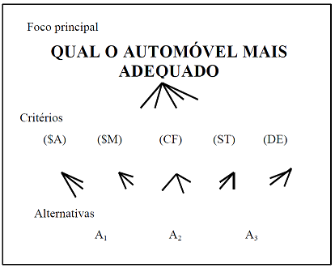
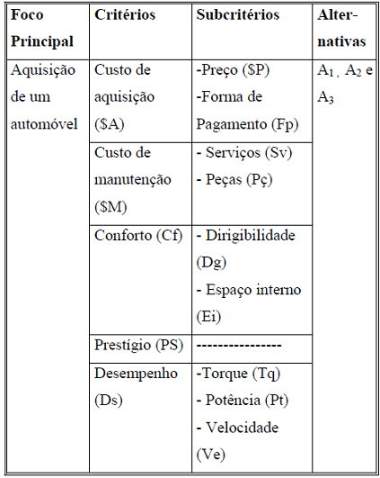
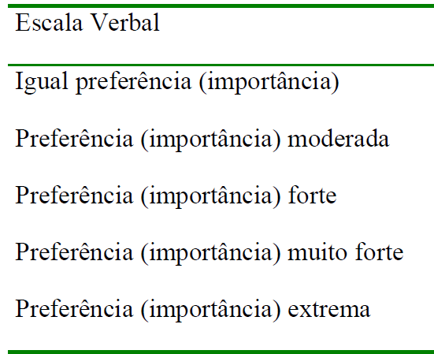
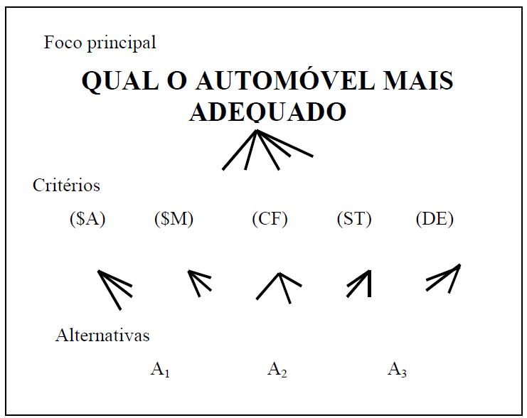
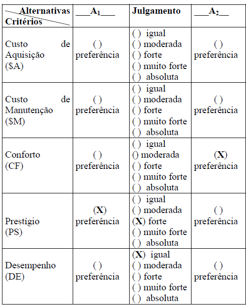
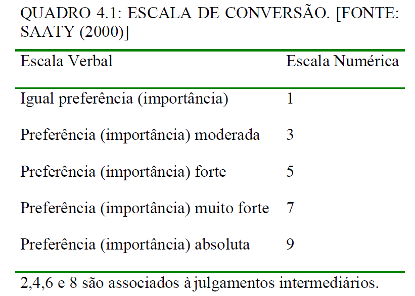
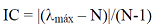

```{r eval=FALSE, message=FALSE, warning=FALSE, include=FALSE, paged.print=FALSE}
setwd("F://GitHub//AHP")
```

## Sobre AHP

  * O AHP é um método proposto por Saaty nos anos 70, afim de auxiliar o AMD (Auxílio Multicritério à Decisão) em relação a análise de multicritérios. 
  * O AHP objetiva a seleção/escolha de alternativas, em um processo que considere diferentes critérios de avaliação. Este método se baseia em três tipos de pensamentos  analíticos : Construção de hierarquias, definição de prioridades e consistência lógica.
  
## Etapas do AHP
* Construção de hierarquia, identificando: foco principal; critérios; subcritérios (quando houverem); e, alternativas. Estes elementos formam a estrutura da hierarquia;
* Aquisição de dados ou coleta de julgamentos de valor emitidos por especialistas;
* Síntese dos dados obtidos dos julgamentos, calculando-se a prioridade de cada alternativa em relação ao foco principal; e,
* Análise da consistência do julgamento, identzificando o quanto o sistema de classificação utilizado é consistente na classificação das alternativas viáveis. Vale registrar que o sistema é
composto pela hierarquia, pelos métodos de aquisição dos julgamentos de valor e pelos avaliadores.

## Construção de Hierarquias 
    Os elementos chaves de uma hierarquia para o tratamento de problemas de decisão são :
 
* Foco principal : Objetivo global. Ex: Compra de um carro, escolha de moradia e etc.
* Conjunto de alternativas viáves : São as escolhas, alternativas .
* Conjunto de critérios : É o conjunto de prioridades, atributos, quesitos ou pontos de vista do qual deve se avaliar o desempenho das alternativas. Este conjunto deve ser : Completo, Mínimo(não deve ter redundância) e Operacional.

## Etapas do AHP

* Definição do foco principal : Definir o objeto central o mais claro possível.
* Identificação das alternativas viáveis : Estabelecer um grupo de alternativas que satisfaçam as condições propostas.
* Identificação do conjunto de critérios : Estabelecer o conjunto de critérios a serem considerados de tal forma que se aproxime o máximo possível da realidade, com pouca abstração.
* Estruturação da hierarquia : Elaborar um desenho da hierarquia, para ilustar como os elementos se relacionam. Exemplo :



* A figura 1 só possui uma camada de critério, dependendo do grau de complexidade pode haver mais de uma camada de critérios. Estas camadas são geradas a partir da estruturação dos critérios em subcritérios. A introdução de subcritérios na hierarquia é uma das ações recomendadas, quando houver dificuldade do avaliador julgar o desempenho das alternativas à luz de um determinado critério, veja figura 2 e 3.

Exemplos:




### Julgamentos de valor Capítulo 3 

* O que é julgar? No AHP o avaliador compara par a par(ou paritariamente) os elementos de uma camada ou nível de heirarquia à luz de cada um dos elementos em conexão com em uma camada superior da hierarquia.
* Seja a hierarquia ilustrada no exemplo "Escolha de automóvel: hierarquia com duas camadas de critérios". Para esta hierarquia, devem ser comparados paritariamente o desempenho de A1 , A2 e A3 à luz de cada um dos elementos de camadas superiores da hierarquia, que estejam diretamente conectados as alternativas.( ver Costa (2002) pag 53)
* A importância dos subcritérios também é comparada à luz de cada um dos critérios ligados aos mesmos.
* Finalmente, compara-se a importância dos critérios à luz do foco principal.

* Como julgar ? Saaty apresenta uma escala específica para a "padronização" das emissões de julgamento de valor pelos avaliadores. Busca-se captar( O que é diferente de eliminar ) a subjetividade inerente a utilização de variáveis qualitativas (figura 4). 




* Métodos de aquisição de dados : A coleta de julgamentos paritários é uma das etapas fundamentais ao uso do AHP. Deve-se buscar desenvolver mecanismos simples e de fácil entendimento para que os avaliadores possam se concentrar apenas na emissão de julgamentos (figura 4).

* Tendo como base essa hierarquia (figura 5) :



* Temos esse exemplo de formulário comparando A1 com A2 (figura 6) : (interpretação ver Costa (2002) pag 59) 




* Quem julga ? São os avaliadores responsáveis pela análise de desempenho(ou importância) dos elementos de uma camada em relação aqueles que estão conectados na camada superior dessa camda. A eficácia dos resultados está associada à competência dos avaliadores em emitir os jungamentos de valor. Por esse motivo, desse ser consultados avaliadores que possuem alto conhecimento sobre o tópico em julgamento.


### Cálculo das prioridades Capítulo 4 (Importante!!!)

* Etapas da priorização : 
  *Obtenção do quadro de julgamentos,
  *Obtenção do quadro de julgamentos normalizados,
  *Obtenção de prioridades médias locais e Obtenção de prioridades médias globais,
  
* Escala de conversão (figura 7) : 




* (ver exemplo desse capítulo se estiver com dúvidas, Costa (2002) ).
* Serão seguidos os seguintes passos :

1- Construir matrízes de comparação para todos os cruzamentos de subcritérios.

2- Normalizar as matrizes (Somatório dos elementos de cada coluna do quadro de julgamentos).

3- Dividir cada elemento pelo resultado da soma de sua coluna.

4- Criar a coluna PML ( prioridades médias locais ) que tem como elemento a soma das linhas divido pelo total de linhas.

5- Criar a PG( Prioridades médias globais ). Para calcular o PG é necessário combinar os PML's, no vetor de prioridades global. (ver ver Costa (2002), pag 80 ) e esse será o vetor que armazena os resultados finais.

### Análise de consistência Capítulo 5 

* Mesmo quando especialistas realizam os julgamentos de valor, pode haver inconsistência, principalmente quando há um grande números de julgamentos. Calcula-se a inconsistência das matrízes pela seguinte formula (figura 8) :




Onde lambda max = maior auto-valor da matriz julgamento e N a ordem da matríz.

*O Índice de Consistência avalia o grau de inconsistência da matriz de
julgamentos paritários.
* Saaty propôs o uso da Razão de Consistência (RC), que permite avaliar a inconsistência em função da ordem da matriz de julgamentos. Caso este valor seja maior do que 0,1 , recomenda-se a revisão do modelo e/ou dos julgamentos. 

A razão de consistência é calculada por: RC = IC/R onde R é um índice de consistência obtido para uma matríz recíproca, com elementos não negativos e gerados de forma randômica.


##Referência

Costa, H. G. **Introdução ao método de análise hierárquica: análise multicritério no auxílio à decisão**. Niterói, RJ, 2002.


