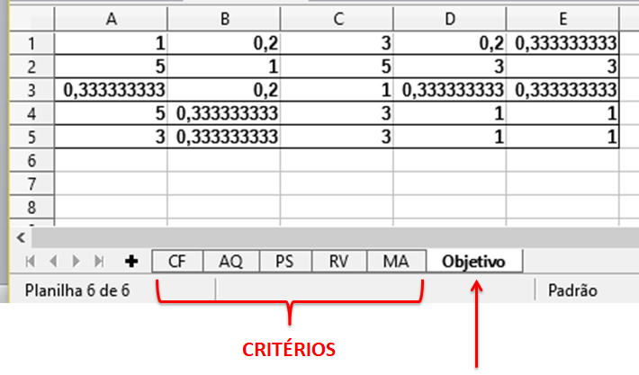
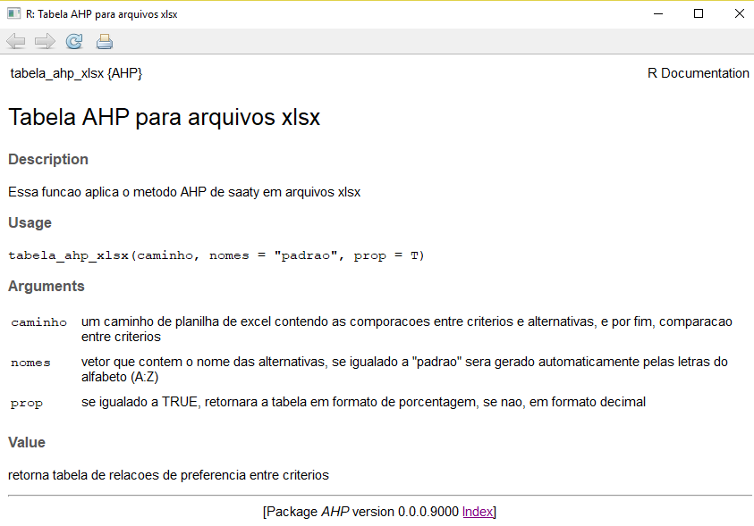

```{r setup, include=FALSE}
knitr::opts_chunk$set(echo = TRUE)
```

## Instalando o pacote

Para instalar o pacote AHP você deverá instalar primeiro o pacote devtools que possibilita a instalação de pacotes armazenados no github. 

Em seguida faça a instalação do pacote AHP de acordo com o script:

```{r eval=FALSE, include=T}
devtools::install_github('Lyncoln/AHP')
```

Após instalado é só chamar o pacote:

```{r message=FALSE, warning=FALSE}
require(AHP)
```

O exemplo apresentado aqui para ilustrar a utilização do pacote é o que consta em Costa (2002).

##Construção da Hierarquia do Problema

A primeira etapa do método AHP é a construção de hierarquia, identificando: foco
principal; critérios; subcritérios (quando
houverem); e, alternativas. Estes elementos
formam a estrutura da hierarquia.

###Foco Principal

Aquisição de um carro popular "zero", que será
submetido as seguintes condições:

* Circular aproximadamente 60 Km/dia no meio urbano,
em vias asfaltadas de uma cidade com temperatura média
no verão da ordem de 29 ºC e que tem trânsito intenso.

###Alternativas Viáveis

Considere o conjunto de
alternativas viáveis $A = {A_1, A_2, ...,A_n}$. Ou seja: dado
um grupo de "condições de contorno" ou quesitos
mínimos, estabelecer um grupo de alternativas que
satisfaçam a tais condições ou quesitos.

No problema de escolha de um automóvel, fazem
parte de $A$ apenas aqueles automóveis que estejam
disponíveis no mercado, a um preço acessível ao decisor.

Neste exemplo considera-se 3 alternativas viáveis que denominaremos de $A_1$, $A_2$ e $A_3$.

###Identificação do conjunto de critérios

Vamos considerar que o decisor determinou os seguintes critérios na resolução do
problema da aquisição do carro: Conforto (CF), Custo de aquisição (AQ), Prestígio (PS), Preço de revenda (RV) e Custo de manutenção (MA).

##Coleta do julgamento de valor

Nesta etapa o decisor deverá consultar avaliadores especialistas e coletar a opinião dos mesmos sobre comparações paritárias dos critérios à luz do objetivo e das alternativas apresentadas:

Será necessário obter julgamentos paritários considerando:

+ Avaliação da importância dos critérios à luz do
foco principal ou do objetivo geral.

+ Avaliação de desempenho das alternativas à luz
dos critérios.

Deve-se buscar
desenvolver mecanismos simples e de fácil entendimento
para que o avaliador possa se concentrar especificamente
na emissão dos julgamentos quanto as importâncias relativas entre:

* Conforto e Custo de Aquisição;
* Conforto e Prestígio;
* Conforto e Preço de Revenda;
* Conforto e Custo de Manutenção;
* Custo de Aquisição e Prestígio;
* Custo de Aquisição e Preço de Revenda;
* Custo de Aquisição e Custo de Manutenção;
* Prestígio e Preço de Revenda;
* Prestígio e Custo de Manutenção;
* Preço de Revenda e Custo de Manutenção.

Esses julgamentos irão gerar um matriz paritária dos critérios à luz dos objetivos. Essa matriz terá dimensão 5x5 pois são 5 critérios neste problema.

Além disso será necessário obter uma matriz paritária das alternativas à luz de cada um dos critérios do problema, ou seja, emissão dos julgamentos quanto as importâncias relativas entre:

* A1 e A2;
* A1 e A3;
* A2 e A3.

Sujeitas aos critérios Conforto (CF), Custo de aquisição (AQ), Prestígio (PS), Preço de revenda (RV) e Custo de manutenção (MA).

Esses julgamentos irão gerar 5 matrizes paritárias das alternativas à luz dos critérios. Cada matriz terá dimensão 3x3 pois são 3 alternativas neste problema.

###Organizando os dados
O pacote supõe que cada uma destas 6 matrizes paritárias devem estar organizadas em um arquivo com extensão xlsx em que:

+ a primeira planilha denominada CF corresponda a Matriz (3x3) referente ao critério Conforto;
+ a segunda planilha denominada AQ corresponda a Matriz (3x3) referente ao critério Custo de Aquisição;
+ a terceira planilha denominada PS corresponda a Matriz (3x3) referente ao critério Prestígio;
+ a quarta planilha denominada RV corresponda a Matriz (3x3) referente ao critério Preço de Revenda;
+ a quinta planilha denominada MA corresponda a Matriz (3x3) referente ao critério Custo de Manutenção;
+ a sexta planilha denominada Objetivo corresponda a Matriz (5x5) referente ao objetivo ou foco do problema.

É importante que o arquivo de dados esteja organizado conforme descrito acima, pois as funções foram construídas supondo essa estrutura de dados.

Veja a figura 1, que ilustra como deve ficar organizado o arquivo de dados.




##Leitura dos dados

Após organizar os dados, foi criado uma função que faz a leitura de dados e organiza as informações sobre a estrutura hierárquica do problema. 

Reforçamos que os dados devem estar organizados de acordo com o descrito na seção anterior (Organizando os dados).

Para que o pacote execute todo o cálculo do método AHP, basta informar o caminho do arquivo de dados no argumento da função **tabela_ahp_xlsx**. É a única informação que o usuário do pacote precisará fornecer. Após executar o comando será retornado uma tabela com os resultados do processo.

Para obter ajuda nesta função execute o comando abaixo:

```{r}
?tabela_ahp_xlsx
```

A documentação desta função pode ser vista na figura 2.



Basta executar a função **tabela_ahp_xlsx** que será fornecido uma tabela com os cálculos do processo. A partir daí já é possível tomar uma decisão. Neste exemplo observa-se que a melhor decisão é a alternativa A1
```{r}
caminho="BD_teste1.xlsx"
resultado=tabela_ahp_xlsx(caminho)
resultado
```


