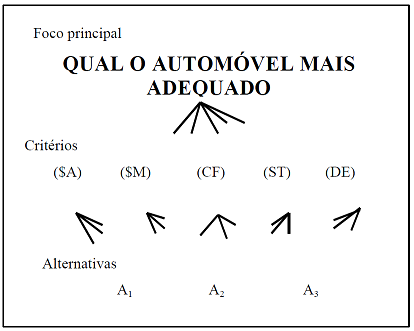
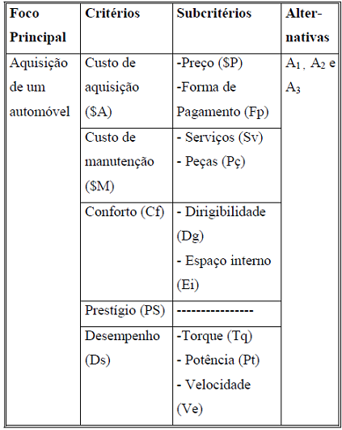

```{r message=FALSE, warning=FALSE, paged.print=FALSE}
setwd("F://AHP//AHP")
```

## Sobre AHP

  * O AHP é um método proposto por Saaty nos anos 70, afim de auxiliar o AMD (Auxílio Multicritério à Decisão) em relação a análise de multicritérios. 
  * O AHP objetiva a seleção/escolha de alternativas, em um processo que considere diferentes critérios de avaliação. Este método se baseia em três tipos de pensamentos  analíticos : Construção de hierarquias, definição de prioridades e consistência lógica.
  
## Etapas do AHP
* Construção de hierarquia, identificando: foco principal; critérios; subcritérios (quando houverem); e, alternativas. Estes elementos formam a estrutura da hierarquia;
* Aquisição de dados ou coleta de julgamentos de valor emitidos por especialistas;
* Síntese dos dados obtidos dos julgamentos, calculando-se a prioridade de cada alternativa em relação ao foco principal; e,
* Análise da consistência do julgamento, identzificando o quanto o sistema de classificação utilizado é consistente na classificação das alternativas viáveis. Vale registrar que o sistema é
composto pela hierarquia, pelos métodos de aquisição dos julgamentos de valor e pelos avaliadores.

## Construção de Hierarquias 
    Os elementos chaves de uma hierarquia para o tratamento de problemas de decisão são :
 
* Foco principal : Objetivo global. Ex: Compra de um carro, escolha de moradia e etc.
* Conjunto de alternativas viáves : São as escolhas, alternativas .
* Conjunto de critérios : É o conjunto de prioridades, atributos, quesitos ou pontos de vista do qual deve se avaliar o desempenho das alternativas. Este conjunto deve ser : Completo, Mínimo(não deve ter redundância) e Operacional.

## Etapas do AHP

* Definição do foco principal : Definir o objeto central o mais claro possível.
* Identificação das alternativas viáveis : Estabelecer um grupo de alternativas que satisfaçam as condições propostas.
* Identificação do conjunto de critérios : Estabelecer o conjunto de critérios a serem considerados de tal forma que se aproxime o máximo possível da realidade, com pouca abstração.
* Estruturação da hierarquia : Elaborar um desenho da hierarquia, para ilustar como os elementos se relacionam. Exemplo : 
* Essa figura só possui uma camada de critério, dependendo do grau de complexidade pode haver mais de uma camada de critérios.Estas camadas são geradas a partir da estruturação dos critérios em subcritérios. A introdução de subcritérios na hierarquia é uma das ações recomendadas, quando houver dificuldade do avaliador julgar o desempenho das alternativas à luz de um determinado critério. Exemplos :   


